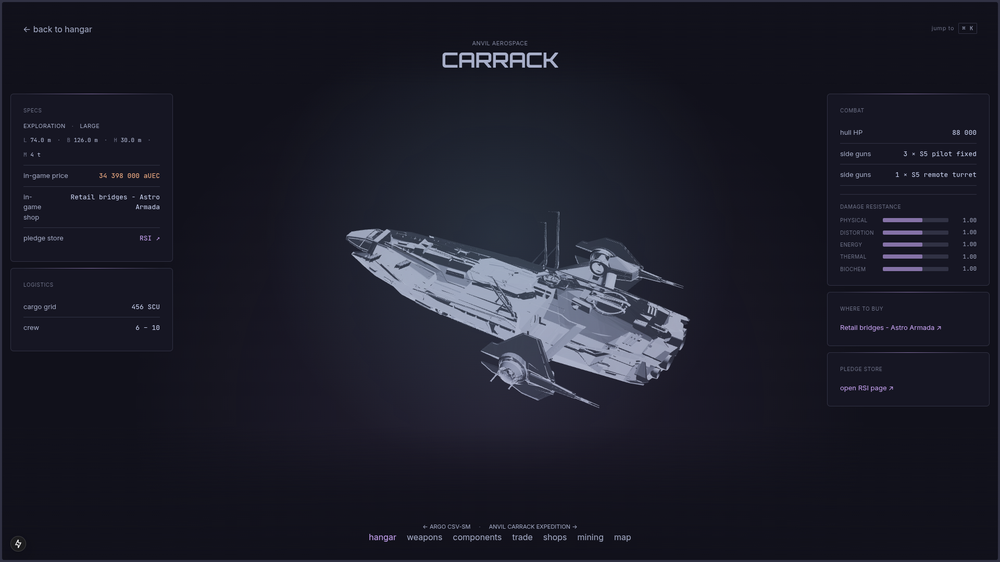
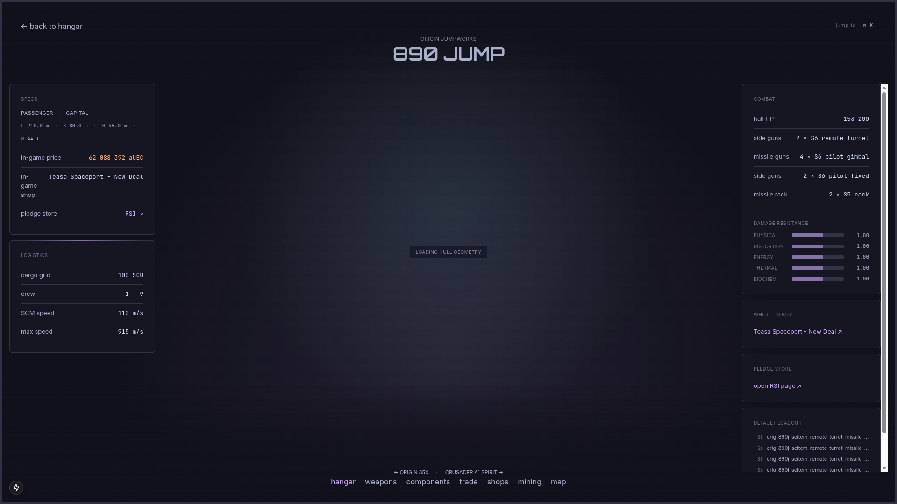
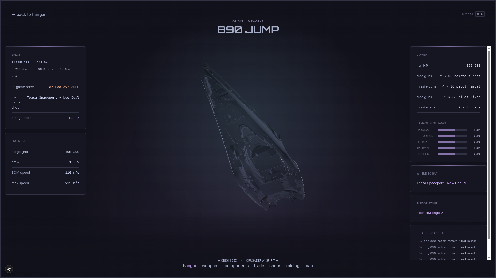
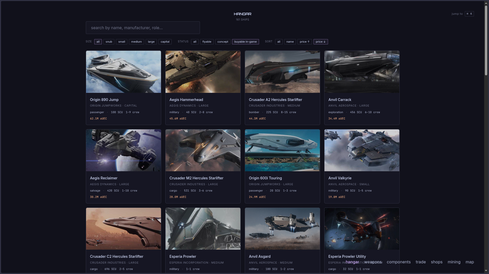

<p align="center">
  
</p>

<h1 align="center">SC-SITE</h1>

<p align="center">
  <strong>A Star Citizen companion tool with 3D ship viewer, live data, and cross-linked everything.</strong>
  <br>
  <sub>Vibecoded with Claude. Built for fun. Not affiliated with CIG or RSI.</sub>
</p>

<p align="center">
  
  
  
  
  
  
</p>

---

<p align="center">
  
</p>

<p align="center">
  
  
</p>

---

## What is this

A personal Star Citizen companion site that pulls data from multiple community sources, cross-links everything, and renders ships in 3D. Not another static wiki — the goal is an interactive exploration tool where every piece of data connects to something else.

This is a **vibecoded passion project**. Built entirely with AI assistance (Claude), iterated fast, designed to be fun. The code reflects that: it works, it ships, it's not enterprise architecture.

## Features

- **272 ships** with enriched data from 4+ sources (UEX, scunpacked, erkul, RSI ship matrix)
- **3D ship viewer** with auto-rotating GLB models for 30 ships (and growing)
- **784 hardpoints** and **645 components** (weapons, shields, coolers, QDs, power plants) with extracted stats
- **601 shops** with 24K+ inventory entries and aUEC prices
- **191 commodities** with terminal price data
- **1991 starmap locations**
- **Full-text search** across ships, weapons, shops, and commodities
- **7 pages**: hangar (ship catalog), ship detail, weapons, components, shops, trade, mining, map
- **Catppuccin Mocha** design system throughout — dark, clean, no marketing fluff

## Tech stack

| Layer | Tech |
|-------|------|
| Runtime | Bun 1.3 |
| Frontend | Next.js 15 App Router, React 19, Tailwind CSS v4 |
| API | Hono on Bun, typed RPC client |
| Database | SQLite via Drizzle ORM |
| 3D | three.js + @react-three/fiber + @react-three/drei |
| Fonts | Inter, JetBrains Mono, Orbitron |
| Lint | Biome (strict) |
| Monorepo | Bun workspaces |

## Architecture

```
sc-site/
  apps/
    web/          Next.js 15 — all pages, 3D viewer, UI
    api/          Hono — REST API serving SQLite data
  packages/
    db/           Drizzle schema + SQLite client
    ui/           Shared React components + design tokens
    sc-data/      Zod schemas for external data sources
  data/
    sc.db         SQLite database (not in repo — built from scrapers)
```

The frontend is fully server-rendered (React Server Components) with client-side 3D via react-three-fiber. The API is a separate Hono server that queries SQLite and returns typed JSON. Both run on Bun.

## Data sources

All data is scraped, merged, and normalized into a single SQLite database. Sources include:

- [**UEX 2.0**](https://uexcorp.space) — commodity prices, shop inventories, vehicle data
- [**scunpacked-data**](https://github.com/StarCitizenWiki/scunpacked-data) — game-extracted XML data (items, vehicles, hardpoints)
- [**erkul.games**](https://erkul.games) — component stats, loadout data
- [**RSI Ship Matrix**](https://robertsspaceindustries.com/ship-matrix) — official ship specs
- [**CStone Finder**](https://finder.cstone.space) — shop locations and prices
- [**maps.adi.sc**](https://maps.adi.sc) — 3D ship models (GLB)

## Running locally

```bash
# clone
git clone https://github.com/ruipedro-pinheiro/SC-SITE.git
cd SC-SITE

# install
bun install

# you need a populated sc.db in data/ — not included in the repo
# (scrapers are WIP, ask me if you want a copy)

# start the API (port 3001)
bun --filter '@sc-site/api' dev

# start the frontend (port 3000)
bun run dev
```

## Screenshots

<details>
<summary>Ship detail — Carrack with 3D viewer</summary>


</details>

<details>
<summary>Ship detail — 890 Jump</summary>


</details>

## Status

Active development. This is a personal project — PRs welcome but no guarantees on response time. The roadmap lives in Linear, not in GitHub issues.

**Next up:**
- Better 3D models (game-extracted CGF to GLB pipeline)
- Cross-linked component pages (ship -> weapon -> shop -> price)
- Meta loadout recommendations
- System map with 3D starmap viewer

## License

This project is for personal and educational use. The Star Citizen game data belongs to Cloud Imperium Games. Community data sources are credited above. 3D models from maps.adi.sc are used with attribution.

---

<p align="center">
  <sub>Made by <a href="https://github.com/ruipedro-pinheiro">Pedro</a> with Claude, running on a Raspberry Pi 4, deployed on Hetzner.</sub>
</p>
